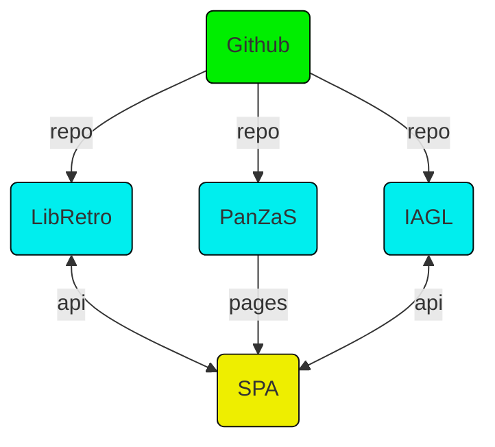

# PanZaS

:joystick: **https://basile.ar/panzas/** :video_game:

Another way to browse video games legacy.

## How it Works?
It tries to bring the best of these collections in the simpler way.

* [Internet Archive Game Launcher](https://github.com/zach-morris/plugin.program.iagl) is a [Kodi](https://github.com/xbmc/xbmc) plugin. It has a curated database composed of XML files (usually one by platform), including games with information, images and most important, links to their roms from [Internet Archive](https://archive.org/).
* [LibRetro](https://github.com/libretro) is the one emulator run all platforms, it has an UI called [RetroArch](https://github.com/libretro/RetroArch) and they both come ready to go in its own GNU/Linux distribution [Lakka](https://github.com/libretro/Lakka-LibreELEC). It uses a database where the RDB files are bytes encoded and it has a dedicated repository for images.

## Special Thanks to... 
Zack Morris and his great database: [IAGL](https://github.com/zach-morris/plugin.program.iagl)

LibRetro team for emulators and database: [LibRetro](https://github.com/libretro/libretro-database)

